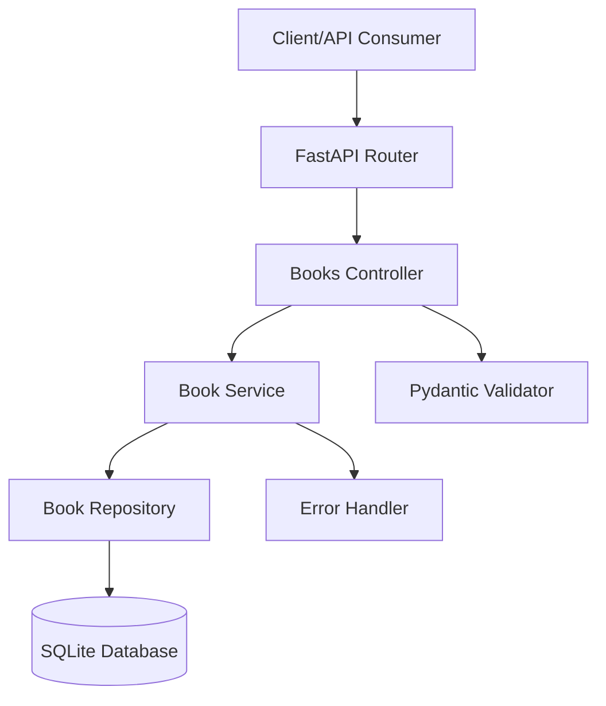

# FastAPI Book Management Application - Architecture Plan

## Project Overview
Build a REST API for book management with CRUD operations using FastAPI, SQLAlchemy ORM, Pydantic, and SQLite database.

## Requirements
- **Acceptance Criteria**: Follow TDD (Test-Driven Development)
- **APIs Required**:
  1. POST /books - Create new book
  2. PUT /books/{id} - Edit existing book
  3. GET /books/{id} - Show a book
  4. GET /books - Show all books
  5. DELETE /books/{id} - Delete a book

- **Technical Details**:
  - SQLite database
  - FastAPI framework
  - Book model fields: id, title, author, published_year, isbn (all required)

## Architecture Design

### System Architecture


### Project Structure
```
fast-api-app/
├── app/
│   ├── __init__.py
│   ├── main.py              # FastAPI application entry point
│   ├── config.py            # Configuration settings
│   ├── database.py          # Database connection and session
│   ├── models/
│   │   ├── __init__.py
│   │   └── book.py          # SQLAlchemy Book model
│   ├── schemas/
│   │   ├── __init__.py
│   │   └── book.py          # Pydantic schemas for request/response
│   ├── api/
│   │   ├── __init__.py
│   │   └── books.py         # Books router/endpoints
│   ├── services/
│   │   ├── __init__.py
│   │   └── book_service.py  # Business logic layer
│   ├── repositories/
│   │   ├── __init__.py
│   │   └── book_repository.py # Database operations
│   └── exceptions/
│       ├── __init__.py
│       └── handlers.py      # Custom exception handlers
├── tests/
│   ├── __init__.py
│   ├── conftest.py          # Test fixtures
│   ├── test_models.py       # Model tests
│   ├── test_repositories.py # Repository tests
│   ├── test_services.py     # Service tests
│   └── test_api.py          # API endpoint tests
├── alembic/                 # Database migrations (optional)
├── requirements.txt
├── .env.example
└── README.md
```

### Database Schema
**Book Table**:
- `id`: Integer, Primary Key, Auto-increment
- `title`: String(255), Not Null
- `author`: String(255), Not Null
- `published_year`: Integer, Not Null
- `isbn`: String(13), Not Null, Unique
- `created_at`: DateTime, Default current timestamp
- `updated_at`: DateTime, Default current timestamp on update

### API Endpoints Design

#### 1. Create Book (POST /books)
**Request Body**:
```json
{
  "title": "The Great Gatsby",
  "author": "F. Scott Fitzgerald",
  "published_year": 1925,
  "isbn": "9780743273565"
}
```

**Response** (201 Created):
```json
{
  "id": 1,
  "title": "The Great Gatsby",
  "author": "F. Scott Fitzgerald",
  "published_year": 1925,
  "isbn": "9780743273565",
  "created_at": "2024-01-01T10:00:00Z",
  "updated_at": "2024-01-01T10:00:00Z"
}
```

#### 2. Get Book (GET /books/{id})
**Response** (200 OK):
```json
{
  "id": 1,
  "title": "The Great Gatsby",
  "author": "F. Scott Fitzgerald",
  "published_year": 1925,
  "isbn": "9780743273565",
  "created_at": "2024-01-01T10:00:00Z",
  "updated_at": "2024-01-01T10:00:00Z"
}
```

#### 3. Get All Books (GET /books)
**Response** (200 OK):
```json
{
  "books": [
    {
      "id": 1,
      "title": "The Great Gatsby",
      "author": "F. Scott Fitzgerald",
      "published_year": 1925,
      "isbn": "9780743273565",
      "created_at": "2024-01-01T10:00:00Z",
      "updated_at": "2024-01-01T10:00:00Z"
    }
  ],
  "total": 1,
  "page": 1,
  "limit": 10
}
```

#### 4. Update Book (PUT /books/{id})
**Request Body**:
```json
{
  "title": "The Great Gatsby (Updated)",
  "author": "F. Scott Fitzgerald",
  "published_year": 1925,
  "isbn": "9780743273565"
}
```

**Response** (200 OK): Updated book object

#### 5. Delete Book (DELETE /books/{id})
**Response** (204 No Content)

### Technology Stack
- **Framework**: FastAPI (with Uvicorn ASGI server)
- **ORM**: SQLAlchemy 2.0
- **Database**: SQLite
- **Validation**: Pydantic v2
- **Testing**: pytest with pytest-asyncio
- **Code Quality**: black, isort, flake8
- **Environment**: python-dotenv

### TDD Approach
1. Write failing unit tests for each component
2. Implement minimal code to pass tests
3. Refactor while keeping tests green
4. Repeat for integration tests

### Dependencies
```txt
fastapi==0.104.1
uvicorn[standard]==0.24.0
sqlalchemy==2.0.23
pydantic==2.5.0
pydantic-settings==2.1.0
python-dotenv==1.0.0
pytest==7.4.3
pytest-asyncio==0.21.1
httpx==0.25.1
alembic==1.12.1 (optional)
```

## Implementation Phases

### Phase 1: Project Setup & Database
1. Initialize project structure
2. Set up virtual environment and dependencies
3. Configure SQLAlchemy with SQLite
4. Create Book model and database schema

### Phase 2: Core Business Logic (TDD)
1. Write tests for BookRepository
2. Implement CRUD operations
3. Write tests for BookService
4. Implement business logic layer

### Phase 3: API Layer (TDD)
1. Write tests for API endpoints
2. Implement FastAPI routes
3. Add Pydantic validation schemas
4. Implement error handling

### Phase 4: Integration & Polish
1. Write integration tests
2. Add logging and monitoring
3. Configure CORS and security middleware
4. Create documentation with OpenAPI/Swagger

## Success Criteria
- All 5 API endpoints functional
- Comprehensive test coverage (>90%)
- Clean, modular code following SOLID principles
- Proper error handling and validation
- FastAPI automatic documentation available at /docs
- SQLite database with proper schema