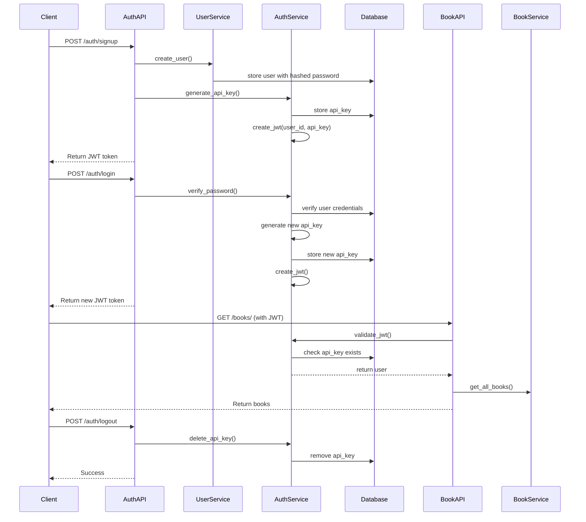

# Authentication Layer Implementation Plan

## Overview
Implement authentication layer with JWT, password hashing (bcrypt), and API key-based token invalidation. Protect existing book CRUD APIs to allow only logged-in users.

## Architecture Design

### Components
1. **User Model** (`app/models/user.py`)
   - id, first_name, last_name, username, hashed_password, created_at, updated_at
   - Follows same pattern as Book model

2. **UserApiKey Model** (`app/models/user_api_key.py`)
   - id, user_id, api_key (random string), created_at
   - Used for JWT validation and logout invalidation

3. **Schemas** (`app/schemas/user.py`)
   - UserBase, UserCreate, UserResponse, UserLogin, Token, ChangePassword

4. **Repository** (`app/repositories/user_repository.py`)
   - CRUD operations for User and UserApiKey
   - Follows BookRepository pattern

5. **Services** (`app/services/`)
   - UserService: user CRUD operations
   - AuthService: password hashing, JWT generation/validation, API key management

6. **Authentication Utilities** (`app/core/auth.py`)
   - JWT configuration (HS256, 5min expiration)
   - Password hashing with bcrypt
   - Token validation with API key check

7. **Auth Router** (`app/api/auth.py`)
   - POST /auth/signup
   - POST /auth/login
   - POST /auth/logout
   - POST /auth/change-password

8. **Authentication Dependency** (`app/api/deps.py`)
   - get_current_user: validates JWT, checks API key in database

9. **Protected Book APIs**
   - Add `Depends(get_current_user)` to all book routes

## File Structure
```
app/
├── models/
│   ├── user.py
│   └── user_api_key.py
├── schemas/
│   └── user.py
├── repositories/
│   ├── user_repository.py
│   └── user_api_key_repository.py
├── services/
│   ├── user_service.py
│   └── auth_service.py
├── core/
│   └── auth.py
├── api/
│   ├── auth.py
│   ├── deps.py
│   └── books.py (updated)
└── main.py (updated)
```

## Authentication Flow



## API Endpoints

### Authentication
- `POST /auth/signup` - Create new user
- `POST /auth/login` - Login and get JWT
- `POST /auth/logout` - Invalidate current JWT
- `POST /auth/change-password` - Change password

### Protected Book APIs (require JWT)
- `POST /books/` - Create book
- `GET /books/` - Get all books
- `GET /books/{id}` - Get book by ID
- `PUT /books/{id}` - Update book
- `DELETE /books/{id}` - Delete book

## JWT Implementation Details
- Algorithm: HS256
- Secret: `JWT_SECRET_KEY` environment variable
- Expiration: 5 minutes
- Claims: `user_id`, `api_key`, `exp`, `iat`
- Validation: Check `api_key` exists in UserApiKey table

## Database Changes
1. New table `users`
2. New table `user_api_keys`
3. Existing `books` table unchanged

## Testing Strategy
1. `test_auth.py` - Authentication endpoint tests
2. Update `test_api.py` - Add authentication to book tests
3. Test scenarios:
   - Signup with valid/invalid data
   - Login with correct/incorrect credentials
   - Access protected APIs without token
   - Access with expired token
   - Logout functionality
   - Change password

## Dependencies to Add
- `bcrypt==4.1.2`
- `python-jose[cryptography]==3.3.0`
- `python-multipart==0.0.6`

## Environment Variables
Add to `.env.example`:
```
JWT_SECRET_KEY=your-secret-key-here
JWT_ALGORITHM=HS256
JWT_EXPIRE_MINUTES=5
```

## Next Steps
1. Review and approve this plan
2. Switch to Code mode for implementation
3. Implement following the established patterns
4. Run tests to verify functionality
5. Update Swagger documentation